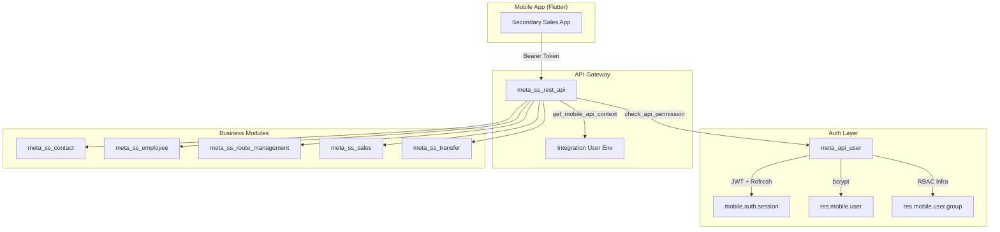
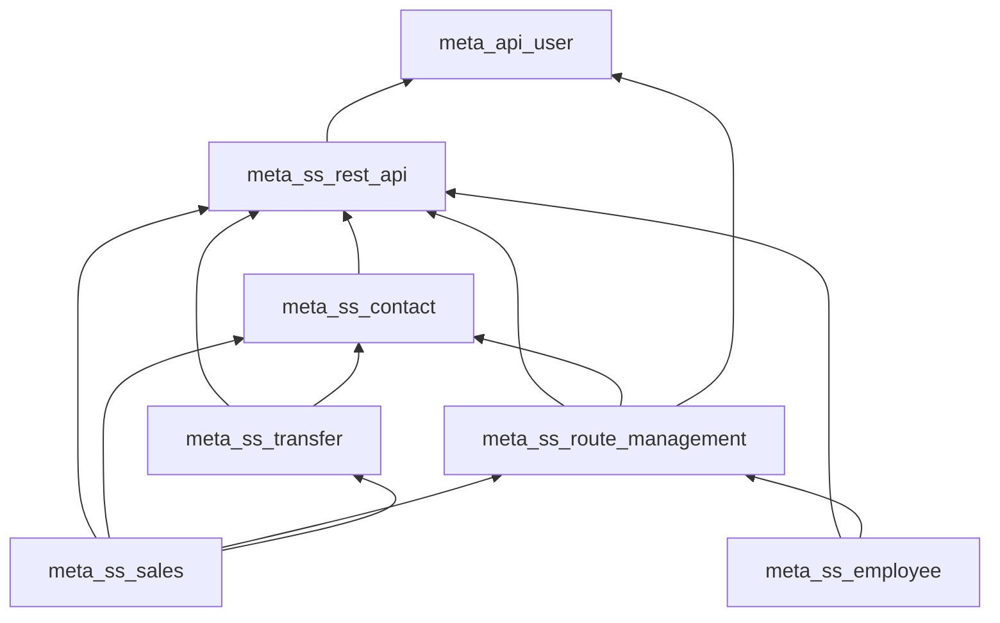

# Secondary Sales Backend — Full Module Review (v2)

> Reviewed: 2026-06-21 — All source files read in full.

## Module Inventory

| Module | Purpose | Key Files | Rating |
|---|---|---|:---:|
| `meta_api_user` | JWT auth, mobile users, sessions, roles, RBAC infra | 5 models, 1 controller, 1 dashboard | ⭐⭐⭐⭐½ |
| `meta_ss_rest_api` | Shared API utils, product/warehouse/location endpoints | 3 controllers, 7 utils | ⭐⭐⭐⭐ |
| `meta_ss_contact` | `res.partner` ext (customer_type, auto-location hierarchy) | 1 model, 1 controller, 1 utils | ⭐⭐⭐⭐ |
| `meta_ss_employee` | Employee CRUD API, team hierarchy | 1 controller, 1 utils | ⭐⭐⭐½ |
| `meta_ss_route_management` | Routes, route planner, outlet visits, visit linking | 7 models, 1 controller (822 lines), 1 utils | ⭐⭐⭐½ |
| `meta_ss_sales` | Sale orders, deliveries, auto-invoicing, PDF print | 2 models, 3 controllers, 3 utils | ⭐⭐⭐⭐ |
| `meta_ss_transfer` | Van loading, virtual locations, returns, scraps | 2 models, 3 controllers, 4 utils | ⭐⭐⭐⭐ |

**Overall Rating: 7.5 / 10** — Well-structured for its stage; main gaps are around authorization enforcement and a few code-quality items.

---

## Architecture Overview



---

## What's Done Well ✅

### 1. Clean Layer Separation
Every module follows a strict `controllers/ → utils/ → models/` pattern. Business logic lives in `utils/`, serialization is co-located, and controllers are thin dispatchers. This is textbook clean architecture for Odoo API modules.

### 2. Auth Foundation is Solid
`meta_api_user` implements a proper production-grade auth system:
- **bcrypt** password hashing with 72-byte limit enforcement
- **JWT** access tokens with configurable TTL (default 15 min)
- **SHA-256** hashed opaque refresh tokens (default 30 days)
- **Device-based session management** — re-login from same device revokes old session
- **Session state machine** — active → expired / logged_out / revoked
- **Integration user pattern** — API calls run as a configured backend user, not SUPERUSER
- **Dashboard OWL component** — admin can monitor sessions/users visually

### 3. Idempotent Operations
Critical for a mobile app with unreliable connectivity:
- Invoice creation checks for existing non-cancelled invoices before duplicating
- Damaged receipt uses origin-based dedup (`search_count` before create)
- Location hierarchy setup is idempotent (find-or-create pattern throughout)
- Route outlet addition updates if line already exists

### 4. Auto-Provisioning
When a distributor is created:
1. Parent folder location created under `Customers`
2. `Stock` child location created and linked to `property_stock_customer`
3. `Scrap` child location created with `scrap_location=True`

When a van loading location is created:
- Paired scrap sibling auto-created under the distributor's scrap location

### 5. Secondary Sale Confirmation Flow
On `action_confirm` for secondary orders, the system:
1. Grows delivery move quantities by `demand + damaged` so the store receives everything on one delivery
2. Creates a separate receipt to move damaged units from store → van scrap
3. Creates a draft invoice for the demand quantity only (not damaged)

This is well-engineered business logic with good edge-case handling.

### 6. Consistent Error Handling
Every controller follows the same pattern:
```python
try:
    ...business logic...
except (AccessDenied, ValidationError, ...) as exc:
    return error_response("validation_error", str(exc))
except Exception:
    request.env.cr.rollback()
    return error_response("server_error", "...")
```

### 7. Delivery Auto-Lot Assignment
The `_auto_assign_lots` helper is reservation-aware — when changing a delivery's source location, the existing picking's reserved quantities are added back to available stock so FIFO suggestions remain accurate. This is a subtle but important detail.

---

## Issues & Improvement Areas ⚠️

### Critical

#### 1. RBAC Infrastructure is Built But Unused
> **Files:** [mobile_role.py](file:///home/abrar/odoo/odoo_18/custom/test_user/meta_api_user/models/mobile_role.py), [common.py](file:///home/abrar/odoo/odoo_18/custom/test_user/meta_ss_rest_api/utils/common.py)

The `res.mobile.user.group` model has:
- `has_mobile_model_access()` — checks CRUD permissions per model
- `get_mobile_rule_domain()` — evaluates record rules with mobile context
- `get_mobile_access_summary()` — returns permissions for app-side gating
- `implied_group_ids` — supports group inheritance

**None of these are called by any controller.** Every API endpoint simply calls `get_mobile_api_context()` → `check_api_permission()` which only validates the JWT token. There is zero role-based access control in practice.

**Impact:** Any authenticated mobile user can access any data and perform any operation. A sales officer can view/edit another officer's orders, routes, and visits.

#### 2. Pervasive `.sudo()` Bypasses Odoo ACLs
> **Files:** All controllers

Nearly every query runs with `.sudo()`:
```python
pickings = request.env["stock.picking"].sudo().search(...)
```

Combined with the integration user pattern, Odoo's native `ir.model.access` and `ir.rule` provide zero protection on the API side.

### Major

#### 3. Route Controller is 822 Lines
> **File:** [routes.py](file:///home/abrar/odoo/odoo_18/custom/test_user/meta_ss_route_management/controllers/routes.py)

This single controller handles:
- Route CRUD (list, create, update, detail)
- Route outlet management (add, remove)
- Outlet visit CRUD (create, update)
- Today's visits query

This should be split into at least `routes.py` and `visits.py` controllers.

#### 4. Outlet Visit `_link_visits` is O(n²)
> **File:** [outlet_visit.py](file:///home/abrar/odoo/odoo_18/custom/test_user/meta_ss_route_management/models/outlet_visit.py#L63-L109)

For every visit created or written, `_link_visits()` searches all existing visits for time-overlapping matches:
```python
candidates = self.search([
    ('visit_type', '=', 'standard'),
    ('employee_id', '=', visit.visited_with_id.id),
    ...
])
for cand in candidates:
    # Check time overlap
```

With volume (hundreds of visits per day across officers), this becomes a performance bottleneck. Consider:
- Adding date-based domain filters to narrow candidates
- Using SQL-based matching instead of Python loops

#### 5. `visited_with_id` Field Defined After Methods
> **File:** [outlet_visit.py](file:///home/abrar/odoo/odoo_18/custom/test_user/meta_ss_route_management/models/outlet_visit.py#L111-L116)

The `visited_with_id` field is declared at the bottom of the class (line 111) after all methods. While this works in Python/Odoo, it breaks readability conventions — fields should be grouped together at the top of the model class. Additionally, `_link_visits()` references `visit.visited_with_id` (line 67) before the field declaration, which is confusing to readers.

#### 6. Inconsistent Error Response Patterns
Two different error response patterns are used:

**Pattern A** (most modules):
```python
return error_response("validation_error", str(exc))
```

**Pattern B** (returns/scraps controllers):
```python
return error_response(400, str(exc))
```

The `error_response()` function uses the first argument as the `error` code string, so Pattern B sends `400` as the error code instead of a descriptive string. This should be standardized.

### Minor

#### 7. Unused Import in `route_management.py`
> **File:** [route_management.py](file:///home/abrar/odoo/odoo_18/custom/test_user/meta_ss_route_management/models/route_management.py#L3)

```python
from typing import Required  # unused
```

#### 8. Duplicate Validation Helpers
- `_get_employee()` exists in `helpers.py` and is reimplemented in `sale_order_details.py`
- `_get_int()` exists in `helpers.py` and reimplemented in `sales.py` utils
- `get_pagination()` is defined in both `meta_ss_rest_api/utils/routes.py` and `meta_ss_transfer/utils/returns.py`

#### 9. `stock_picking.py` Compute Self-Assignment
> **File:** [stock_picking.py](file:///home/abrar/odoo/odoo_18/custom/test_user/meta_ss_sales/models/stock_picking.py#L19-L25)

```python
@api.depends("sale_id.so_employee_id")
def _compute_so_employee_id(self):
    for picking in self:
        if picking.sale_id and picking.sale_id.so_employee_id:
            picking.so_employee_id = picking.sale_id.so_employee_id
        else:
            picking.so_employee_id = picking.so_employee_id  # ← no-op
```

The `else` branch assigns the field to itself, which is a no-op but reads as a bug. Should be `picking.so_employee_id = False` or the else branch should be removed entirely (stored computed fields keep their previous value).

#### 10. Missing `license` in `meta_ss_employee` Manifest
> **File:** [__manifest__.py](file:///home/abrar/odoo/odoo_18/custom/test_user/meta_ss_employee/__manifest__.py)

No `license` key. All other modules specify `"license": "LGPL-3"`. While optional, Odoo will show a warning during module upgrade.

#### 11. Version Inconsistency
- Most modules use `"version": "18.0.0.1.0"` (standard Odoo convention)
- `meta_ss_employee` uses `"version": "1.0"` (non-standard)

---

## Dependency Graph



> [!NOTE]
> `meta_ss_sales` sits at the top of the dependency tree, depending on all other modules. This is expected since sales orders reference routes, contacts, and transfers.

---

## API Endpoint Inventory

### Auth (`meta_api_user`)
| Method | Route | Auth | Purpose |
|---|---|---|---|
| POST | `/api/v1/auth/bootstrap-session` | none | Bootstrap Odoo session for integration user |
| POST | `/api/v1/auth/login` | none | Authenticate mobile user, return JWT + refresh |
| POST | `/api/v1/auth/refresh` | user | Refresh access token |
| POST | `/api/v1/auth/logout` | user | Revoke session |

### Products & Warehouses (`meta_ss_rest_api`)
| Method | Route | Auth | Purpose |
|---|---|---|---|
| POST | `/api/v1/products` | user | List products |
| POST | `/api/v1/warehouses` | user | List warehouses |
| POST | `/api/v1/warehouses/<id>` | user | Warehouse detail |
| POST | `/api/v1/locations` | user | List locations |
| POST | `/api/v1/locations/by-employee` | user | Employee's van locations |

### Contacts (`meta_ss_contact`)
| Method | Route | Auth | Purpose |
|---|---|---|---|
| POST | `/api/v1/contacts` | user | List/search contacts |
| POST | `/api/v1/contacts/create` | user | Create distributor/outlet |
| POST | `/api/v1/contacts/<id>` | user | Contact detail |
| POST | `/api/v1/contacts/<id>/update` | user | Update contact |
| POST | `/api/v1/contacts/<id>/visits` | user | Contact visit history |

### Employees (`meta_ss_employee`)
| Method | Route | Auth | Purpose |
|---|---|---|---|
| POST | `/api/v1/employees` | user | List employees |
| POST | `/api/v1/employees/create` | user | Create employee |
| POST | `/api/v1/employees/<id>` | user | Employee detail |
| POST | `/api/v1/employees/<id>/update` | user | Update employee |

### Routes & Visits (`meta_ss_route_management`)
| Method | Route | Auth | Purpose |
|---|---|---|---|
| POST | `/api/v1/ss/routes` | user | List employee routes |
| POST | `/api/v1/ss/routes/create` | user | Create route |
| POST | `/api/v1/ss/routes/<id>` | user | Route detail |
| POST | `/api/v1/ss/routes/<id>/update` | user | Update route |
| POST | `/api/v1/ss/routes/<id>/outlets/add` | user | Add outlet to route |
| POST | `/api/v1/ss/routes/<id>/outlets/<id>/remove` | user | Remove outlet from route |
| POST | `/api/v1/visits/create` | user | Create outlet visit |
| POST | `/api/v1/visits/<id>/update` | user | Update visit (check-out) |
| POST | `/api/v1/visits/today` | user | Today's active visit status |

### Sales (`meta_ss_sales`)
| Method | Route | Auth | Purpose |
|---|---|---|---|
| POST | `/api/v1/sale-orders` | user | List sale orders |
| POST | `/api/v1/sale-orders/create` | user | Create sale order |
| POST | `/api/v1/sale-orders/<id>` | user | Order detail |
| POST | `/api/v1/sale-orders/<id>/update` | user | Update order (draft/confirmed) |
| POST | `/api/v1/sale-orders/<id>/action` | user | Confirm/cancel order |
| POST | `/api/v1/sale-orders/<id>/print` | user | Generate PDF (invoice or SO) |

### Deliveries (`meta_ss_sales`)
| Method | Route | Auth | Purpose |
|---|---|---|---|
| POST | `/api/v1/deliveries` | user | List deliveries |
| POST | `/api/v1/deliveries/prepare` | user | Prepare delivery validation data |
| POST | `/api/v1/deliveries/products/<id>/lots` | user | Lot availability for delivery |
| POST | `/api/v1/deliveries/products/<id>/auto-assign-lots` | user | FIFO lot auto-assignment |
| POST | `/api/v1/deliveries/<id>/action` | user | Validate/cancel delivery |

### Returns (`meta_ss_transfer`)
| Method | Route | Auth | Purpose |
|---|---|---|---|
| POST | `/api/v1/returns/prepare` | user | Prepare return context |
| POST | `/api/v1/returns` | user | List returns |
| POST | `/api/v1/returns/products` | user | Available return products |
| POST | `/api/v1/returns/products/<id>/lots` | user | Return product lot availability |
| POST | `/api/v1/returns/create` | user | Create return delivery |
| POST | `/api/v1/returns/<id>` | user | Return detail |
| POST | `/api/v1/returns/<id>/update` | user | Update return |

### Scraps (`meta_ss_transfer`)
| Method | Route | Auth | Purpose |
|---|---|---|---|
| POST | `/api/v1/scraps/prepare` | user | Prepare scrap context |
| POST | `/api/v1/scraps` | user | List scraps |
| POST | `/api/v1/scraps/products` | user | Available scrap products |
| POST | `/api/v1/scraps/products/<id>/lots` | user | Scrap product lot availability |
| POST | `/api/v1/scraps/create` | user | Create scrap delivery |
| POST | `/api/v1/scraps/<id>` | user | Scrap detail |
| POST | `/api/v1/scraps/<id>/update` | user | Update scrap |

### Van Loading (`meta_ss_transfer`)
| Method | Route | Auth | Purpose |
|---|---|---|---|
| POST | `/api/v1/virtual-transfers` | user | List van transfers |
| POST | `/api/v1/virtual-transfers/create` | user | Create van load/unload |
| POST | `/api/v1/virtual-transfers/<id>` | user | Transfer detail |
| POST | `/api/v1/virtual-transfers/<id>/update` | user | Update transfer lines |
| POST | `/api/v1/virtual-transfers/<id>/action` | user | Validate/cancel transfer |
| POST | `/api/v1/virtual-locations` | user | List virtual locations |
| POST | `/api/v1/virtual-locations/products` | user | Products in a virtual location |
| POST | `/api/v1/virtual-locations/products/<id>/lots` | user | Lot availability |
| POST | `/api/v1/virtual-locations/products/<id>/auto-assign-lots` | user | FIFO lot auto-assignment |

**Total: ~50 API endpoints**

---

## Prioritized Recommendations

### Priority 1 — Quick Fixes (< 1 hour each)

| # | Fix | File |
|---|---|---|
| 1 | Remove `from typing import Required` | `route_management.py:3` |
| 2 | Fix self-assignment in `_compute_so_employee_id` | `meta_ss_sales/models/stock_picking.py:25` |
| 3 | Add `"license": "LGPL-3"` to `meta_ss_employee` manifest | `meta_ss_employee/__manifest__.py` |
| 4 | Fix version to `"18.0.0.1.0"` in `meta_ss_employee` manifest | `meta_ss_employee/__manifest__.py` |
| 5 | Standardize error codes in returns/scraps controllers (use strings, not `400`) | `returns.py`, `scraps.py` |
| 6 | Move `visited_with_id` field to top of `OutletVisit` class with other fields | `outlet_visit.py` |

### Priority 2 — Medium Effort (1-3 days)

| # | Improvement | Impact |
|---|---|---|
| 7 | Split `routes.py` controller into `routes.py` + `visits.py` | Maintainability |
| 8 | Consolidate duplicate helpers (`_get_employee`, `_get_int`, `get_pagination`) | Code quality |
| 9 | Add date-range filter to `_link_visits()` search to reduce candidate set | Performance |
| 10 | Wire RBAC: call `has_mobile_model_access()` in `get_mobile_api_context()` | Security |

### Priority 3 — Strategic (1-2 weeks)

| # | Initiative | Impact |
|---|---|---|
| 11 | Activate the full RBAC pipeline (model access + record rules + app-side gating) | Security |
| 12 | Implement offline-first read caching (products, contacts, routes) | UX |
| 13 | Add API rate limiting per mobile user | Stability |
| 14 | Add automated API integration tests | Reliability |

---

## Summary

The codebase is **well-structured and production-ready** for its current stage. The `controllers/ → utils/ → models/` separation is clean, error handling is consistent, and the business logic (especially the secondary sale confirmation flow with damaged goods handling) is thoughtfully designed.

The **single biggest improvement** is activating the RBAC infrastructure that's already built in `mobile_role.py` — the code is there, it just needs wiring into the API middleware. This would transform the system from "any authenticated user can do anything" to proper role-based access control with zero new infrastructure.

The quick fixes in Priority 1 are low-risk improvements that can be done immediately.
