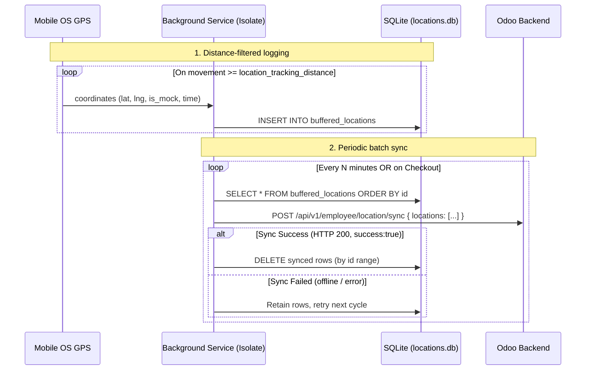

# Implementation Plan: Offline-Resilient Location Buffering (SQLite + Batch Sync)

This document details the architecture and implementation steps for reliable GPS
tracking in the workforce mobile app.

The goal is offline-resilient, battery-friendly location capture using a local SQLite
buffer and periodic batch sync. **Path simplification is achieved upstream via
distance-based logging** — the app only records a point after the user has moved a
configured distance, so the stream is naturally sparse before it ever leaves the
device. No client-side simplification algorithm is used.

---

## 1. Technical Architecture & Data Flow

SQLite (not SharedPreferences) gives us ACID durability, high-frequency write
performance, and protection against corruption on unexpected app termination.



Key properties:

* **Simplification happens at capture time** via the OS/Geolocator distance filter,
  driven by the backend config `location_tracking_distance`. No client-side algorithm
  is required.
* **No anchor point is retained.** Because each buffered row is a distinct real
  position and the backend orders checkpoints by `recorded_at` per `attendance_id`,
  consecutive batches join up naturally on the map. Deleting synced rows outright
  avoids re-uploading duplicates (the sync endpoint does not de-duplicate).

---

## 2. Backend Contract (already implemented)

The client integrates with the existing endpoint — no backend change needed for the
core plan.

* **Endpoint**: `POST /api/v1/employee/location/sync`
  (`sync_employee_locations`, `type="json"`, `auth="user"`)
* **Request body**: `{ "locations": [ { latitude, longitude, recorded_at, is_mock }, ... ] }`
  * `recorded_at` must be a datetime string that falls **inside an attendance
    session** (`check_in <= recorded_at <= check_out`, or an open session).
    Points outside any session are silently discarded server-side and returned in
    `discarded_count`.
* **Response**: `{ success, data: { synced_count, discarded_count } }`
* **Config knobs** (`res.config.settings`, read these; do not hardcode):
  * `location_tracking_type` — `time` | `distance` | `both`
  * `location_tracking_distance` — meters (default `30`)
  * `location_tracking_interval` — seconds (default `5`)

> Optional backend hardening (recommended if duplicates are ever observed): add a
> SQL unique constraint on `(employee_id, recorded_at)` to `sales.employee.location`
> so a retried batch can never create duplicate rows.

---

## 3. Implementation Steps

### Step 1: Add Dependencies to `pubspec.yaml`

```yaml
dependencies:
  sqflite: ^2.4.0
  path: ^1.9.0
```

---

### Step 2: SQLite Database Helper (`location_db_helper.dart`)

A dedicated helper managing the connection, schema, and transactional queries.

* **Database**: `locations.db`
* **Table Schema**:
    ```sql
    CREATE TABLE buffered_locations (
        id INTEGER PRIMARY KEY AUTOINCREMENT,
        latitude REAL NOT NULL,
        longitude REAL NOT NULL,
        recorded_at TEXT NOT NULL,   -- ISO-8601 / server-compatible datetime
        is_mock INTEGER NOT NULL     -- 0 / 1
    );
    ```
* **Operations**:
  * `insertLocation(lat, lng, recordedAt, isMock)` — quick non-blocking insert.
  * `getBufferedLocations()` — all rows, `ORDER BY id ASC` (chronological).
  * `deleteUpToId(int maxSyncedId)` — delete every row with `id <= maxSyncedId`
    after a successful sync. (No anchor retained — see §1.)
  * `getLocationsCount()` — count of unsynced rows.

> Open the DB **inside the background-service isolate**. `flutter_background_service`
> runs its own engine, so the connection must be established there, not reused from
> the UI isolate.

---

### Step 3: Distance-Based Logging (the primary simplification)

Configure `Geolocator` so the OS only emits a fix once the device has moved the
configured distance. This is the main mechanism that keeps the dataset small.

```dart
final settings = LocationSettings(
  accuracy: LocationAccuracy.high,
  distanceFilter: locationTrackingDistance, // e.g. 30 (meters), from backend config
);
```

* Honor `location_tracking_type`:
  * `distance` → rely on `distanceFilter` only.
  * `time` → poll every `location_tracking_interval` seconds (distanceFilter 0).
  * `both` → poll on interval, but skip inserting a row if the point is within
    `location_tracking_distance` of the last buffered point.
* This removes standing-still spam and slow-crawl redundancy at the source, without
  any post-processing algorithm.

---

### Step 4: Refactor Background Service Tick (`location_tracking_service.dart`)

1. Receive the current coordinate (from the distance-filtered stream, or interval
   poll per §3).
2. `insertLocation(...)` into SQLite.
3. Track elapsed time since the last successful sync. When it exceeds the configured
   sync window (**derive from `location_tracking_interval`; do not hardcode a tick
   count**), or a checkout is in progress:
   * Load all rows via `getBufferedLocations()`.
   * POST them to `/api/v1/employee/location/sync`.
   * **On success**: `deleteUpToId(maxId)` where `maxId` is the largest `id` in the
     uploaded set. Reset the sync timer.
   * **On failure**: keep rows intact; retry next cycle (offline accumulation).

> Choose the sync window for the product need, not a fixed 1 hour: if a manager ever
> needs near-live visibility (`my_team` shows `last_sync_time`/"Active Shift"), use a
> few minutes; if the route is only ever reviewed after the fact
> (`get_employee_checkpoints` is per-date), a longer window saves battery/data.

---

### Step 5: Immediate Checkout Sync (Force Sync)

* Register a `'forceSync'` listener inside the background-service isolate.
* In `AttendanceProvider`, before stopping tracking, trigger the sync and **await its
  completion** rather than sleeping a fixed delay (an upload can exceed 1–2s on poor
  networks; a fixed delay risks killing the isolate mid-upload):

    ```dart
    final service = FlutterBackgroundService();
    service.invoke('forceSync');
    // Wait for the isolate to signal completion (e.g. via service.on('syncDone'))
    // with a sane timeout, THEN stop().
    await _awaitSyncDone(timeout: const Duration(seconds: 10));
    service.invoke('stopService');
    ```

* If the force sync times out or fails, do **not** clear the buffer — the rows persist
  in SQLite and flush on the next shift.

---

## 4. Handling Edge Cases

* **Offline**: failed uploads retain the buffer; points keep accumulating and the
  full backlog flushes on the next successful cycle. No history is lost.
* **Path continuity across batches**: guaranteed by the backend ordering checkpoints
  by `recorded_at` within an `attendance_id`; no client-side anchor needed.
* **Points outside a shift**: discarded server-side (`discarded_count`); harmless.
  Prefer to only run tracking while an attendance session is open.
* **GPS jitter / spoofing**: distance-filtering does not fix noisy fixes; `is_mock` is
  captured and stored for server-side review. Accuracy filtering is out of scope for
  this plan.
