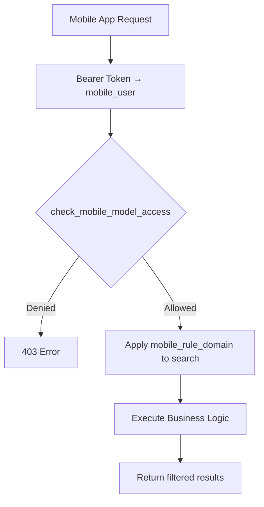
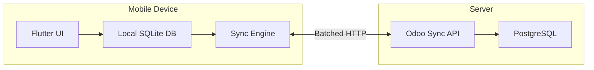

# Secondary Sales Backend — Module Review

## Module Inventory

| Module | Purpose | Lines of Python | Rating |
|---|---|---:|:---:|
| `meta_api_user` | JWT auth, mobile users, sessions, roles | ~1,200 | ⭐⭐⭐⭐½ |
| `meta_ss_rest_api` | Shared API utils, product/warehouse/location endpoints | ~650 | ⭐⭐⭐⭐ |
| `meta_ss_contact` | `res.partner` ext (customer_type, auto-location hierarchy) | ~390 | ⭐⭐⭐⭐ |
| `meta_ss_employee` | Employee CRUD API, team hierarchy | ~400 | ⭐⭐⭐½ |
| `meta_ss_route_management` | Routes, route planner, outlet visits, visit linking | ~1,300 | ⭐⭐⭐½ |
| `meta_ss_sales` | Sale orders, deliveries, auto-invoicing, PDF print | ~1,400 | ⭐⭐⭐⭐ |
| `meta_ss_transfer` | Van loading transfers, virtual locations, scrap auto-create | ~1,100 | ⭐⭐⭐⭐ |

**Overall Rating: 7.5 / 10**

---

## Architecture Review

### What's Done Well ✅

1. **Clean layer separation** — Every module follows a `controllers/ → utils/ → models/` pattern. Business logic lives in `utils/`, serialization is co-located, and controllers are thin dispatchers. This is excellent for testability and maintainability.

2. **Auth foundation is solid** — `meta_api_user` implements a proper JWT + refresh token flow with bcrypt password hashing, SHA-256 token hashing, session revocation, device tracking, and configurable TTLs. The `get_mobile_api_context()` gateway pattern enforces auth consistently across all API endpoints.

3. **Idempotent operations** — Invoice creation, damaged receipt generation, and location hierarchy setup all check for existing records before creating duplicates. This is critical for a mobile app that may retry failed requests.

4. **Auto-provisioning is thoughtful** — When a distributor is created, the system automatically creates Stock/Scrap child locations, and van loading locations auto-create paired scrap siblings. This eliminates manual setup.

5. **Consistent error handling** — Every controller catches domain exceptions (`ValidationError`, `AccessDenied`, etc.) separately from unhandled exceptions, and uses `error_response()` for a uniform JSON error contract.

6. **Employee hierarchy (`child_of`)** — Sales list visibility, order detail access, and employee browsing all respect the Odoo parent hierarchy, so TSMs naturally see their team's data.

### Issues & Improvement Areas ⚠️

1. **Pervasive `.sudo()` usage** — Nearly every API endpoint does `env["model"].sudo()` immediately. This bypasses Odoo's entire access control system. While this works because you have a single "integration user" pattern, it means the Odoo ACL layer provides zero protection on the API side. Every permission check is hand-coded in Python.

2. **No `ir.model.access` or `ir.rule` for API models** — `sale.order`, `stock.picking`, `res.partner`, `product.product` have no module-specific access rules. The route management models (`sale.route`, `outlet.visit`, `route.planner`) only grant `base.group_user` access — no role differentiation.

3. **Duplicate validation helpers** — `_get_employee()` exists in both `helpers.py` and `sale_order_details.py` (`get_request_employee`). `_get_int()` exists in both `helpers.py` and `sales.py`. These should be consolidated.

4. **The `config.py` hardcoded environment pattern** — Server URLs and DB names are hardcoded in Python. This should use `ir.config_parameter` or environment variables.

5. **No API versioning enforcement** — While `API_VERSION = "v1"` exists as a prefix, there's no version negotiation or deprecation mechanism.

6. **Route controller is oversized** — At 822 lines, `routes.py` controller handles routes, visits, route plans, and outlet assignments. This should be split into separate controllers.

7. **Missing `_name` on stock.picking inherit** — `meta_ss_sales/models/stock_picking.py` inherits `stock.picking` but the file is only 10 lines; verify it's needed.

8. **Outlet visit `_link_visits` is O(n²)** — For each visit created/written, it searches all standard/join visits for overlapping time windows. With volume, this will become slow.

9. **`from typing import Required`** in `route_management.py` — Unused import.

---

## Opinion 1: Role-Based Authorization Strategy

> Using `ir.model.access` + `ir.rule` for both app visibility and API protection

### Current State

You already have the infrastructure partially built:

- `res.mobile.user.group` (the "role") can hold M2M links to `ir.model.access` and `ir.rule` records
- `get_mobile_access_summary()` aggregates CRUD permissions across implied groups
- `has_mobile_model_access()` checks model-level permissions
- `get_mobile_rule_domain()` evaluates record rules with a mobile-specific eval context (`mobile_user`, `employee`, `company_id`)

**But none of these are actually called by any controller.** The infrastructure is built, unused.

### Recommended Architecture



#### Layer 1: Model Access (coarse CRUD gates)

Create `ir.model.access` records that define which role can do what:

| Role | sale.order | stock.picking | outlet.visit | sale.route |
|---|---|---|---|---|
| **SO** (Sales Officer) | R, C | R | R, C, W | R |
| **TSM** (Territory Sales Manager) | R | R | R | R, C, W, D |
| **ASM** (Area Sales Manager) | R | R | R | R |
| **Admin** | Full | Full | Full | Full |

Implement this by adding a **mandatory middleware** call in `get_mobile_api_context()`:

```python
def get_mobile_api_context(payload, require_employee=False, model=None, operation="read"):
    mobile_user = check_api_permission()
    # NEW: model-level gate
    if model and mobile_user.group_id:
        if not mobile_user.group_id.has_mobile_model_access(model, operation):
            raise AccessDenied(f"Your role does not allow {operation} on {model}.")
    ...
```

This way every endpoint automatically enforces role permissions without per-controller code.

#### Layer 2: Record Rules (row-level filtering)

Use `ir.rule` records with domain expressions evaluated in the mobile context:

**Example rules:**

| Rule Name | Model | Domain | Effect |
|---|---|---|---|
| SO sees own orders | sale.order | `[('so_employee_id', '=', employee.id)]` | SO only sees own orders |
| TSM sees team orders | sale.order | `[('so_employee_id', 'child_of', employee.id)]` | TSM sees team orders |
| SO sees own visits | outlet.visit | `[('employee_id', '=', employee.id)]` | SO only sees own visits |
| TSM sees team visits | outlet.visit | `[('employee_id', 'child_of', employee.id)]` | TSM sees team visits |

Apply these by injecting the domain into every list/search query:

```python
# In build_sale_order_domain or similar
rule_domain = mobile_user.group_id.get_mobile_rule_domain(
    "sale.order", "read", mobile_user=mobile_user
)
if rule_domain:
    domain = expression.AND([domain, rule_domain])
```

#### Layer 3: Feature Visibility (app-side)

Return the access summary in the login response so the Flutter app can show/hide features:

```python
# In login_and_create_session response
"permissions": group.get_mobile_access_summary() if group else {}
```

The app caches this and uses it to:
- Show/hide menu items (e.g., hide "Create Route" for SO role)
- Enable/disable buttons (e.g., disable "Confirm Order" for ASM)
- Filter API calls (don't request data the user can't see)

### Implementation Steps

1. **Create role records** via XML data: SO, TSM, ASM, Admin groups in `res.mobile.user.group`
2. **Create `ir.model.access` records** linked to those groups
3. **Create `ir.rule` records** with mobile-specific domains
4. **Wire `get_mobile_api_context()`** to enforce model access + inject rule domains
5. **Return permissions in login response** for app-side feature gating
6. **Stop using `.sudo()` everywhere** — use the integration user's env but apply rule domains

> [!IMPORTANT]
> The biggest change is **not adding new code** — it's about actually using the `mobile_role.py` infrastructure you already built. Every piece is there; it just needs wiring.

---

## Opinion 2: Offline-First Architecture

### Why Offline-First Matters for This App

Sales officers work in the field, often in areas with poor/no connectivity. They need to:
- Check in/out of outlet visits
- Create sale orders
- View product catalogs and pricing
- See their route plan for the day
- Load van stock

If any of these fail due to connectivity, productivity drops to zero.

### Recommended Architecture



#### Data Classification

| Data Category | Sync Strategy | Local Storage | Conflict Resolution |
|---|---|---|---|
| **Products & Prices** | Pull-only, periodic | Full cache | Server wins |
| **Contacts/Outlets** | Pull-only, periodic | Full cache | Server wins |
| **Routes & Plans** | Pull-only, daily | Day's plan | Server wins |
| **Sale Orders** | Push + Pull | Created offline | Merge (see below) |
| **Outlet Visits** | Push + Pull | Check-in/out times | Last-write-wins |
| **Van Transfers** | Push + Pull | Created offline | Server validates |
| **Deliveries** | Online only | - | N/A (needs real-time stock) |

#### Key Design Decisions

**1. Local Database: SQLite via `drift` (or `sqflite`)**

Store a simplified, denormalized version of server data locally:

```
┌─ products (id, name, code, price, uom_id, tracking, updated_at)
├─ contacts (id, name, type, phone, address, updated_at)
├─ routes (id, name, code, outlet_ids_json, updated_at)
├─ sale_orders (id, name, state, partner_id, lines_json, synced, server_id, updated_at)
├─ visits (id, employee_id, outlet_id, check_in, check_out, synced, server_id)
└─ sync_queue (id, model, operation, payload_json, created_at, retry_count, status)
```

**2. Sync Queue Pattern**

All write operations go to a local `sync_queue` first:

```dart
class SyncQueue {
  Future<void> enqueue(String model, String operation, Map<String, dynamic> payload) async {
    await db.insert('sync_queue', {
      'model': model,
      'operation': operation,
      'payload': jsonEncode(payload),
      'status': 'pending',
      'created_at': DateTime.now().toIso8601String(),
    });
    // Try immediate sync if online
    if (await _isOnline()) await processQueue();
  }
}
```

**3. Backend Sync Endpoint**

Add a single batch sync endpoint to the Odoo API:

```python
@http.route(f"{API_PREFIX}/sync", type="json", auth="user", methods=["POST"])
def sync(self, **payload):
    """Process a batch of offline operations and return updated data."""
    results = []
    for op in payload.get("operations", []):
        try:
            result = self._process_sync_operation(op)
            results.append({"client_id": op["client_id"], "success": True, "data": result})
        except Exception as e:
            results.append({"client_id": op["client_id"], "success": False, "error": str(e)})
    
    # Also return any data updated since client's last sync
    last_sync = payload.get("last_sync_at")
    updated = self._get_updates_since(last_sync)
    
    return {"results": results, "updates": updated, "server_time": fields.Datetime.now()}
```

**4. Conflict Resolution for Sale Orders**

Since sale orders can be created offline:

- Assign a **client-side UUID** at creation time
- On sync, the server creates the order and returns the real Odoo ID
- If the server already has an order with that UUID (duplicate sync), return the existing one
- Add a `client_uuid` field to `sale.order`:

```python
client_uuid = fields.Char(index=True, copy=False, help="Mobile app deduplication key")
```

**5. Periodic Background Sync**

```dart
// In main.dart or a background service
Timer.periodic(Duration(minutes: 5), (_) async {
  if (await isOnline()) {
    await syncEngine.pushPendingOperations();
    await syncEngine.pullUpdatedMasterData();
  }
});
```

### Implementation Phases

| Phase | Scope | Effort |
|---|---|---|
| **Phase 1** | Read-only cache (products, contacts, routes) | 1-2 weeks |
| **Phase 2** | Offline sale order creation with sync queue | 1-2 weeks |
| **Phase 3** | Offline visits (check-in/out) | 1 week |
| **Phase 4** | Offline van transfers | 1 week |
| **Phase 5** | Conflict resolution, retry logic, status UI | 1 week |

> [!TIP]
> **Start with Phase 1** — even just caching products and contacts makes the app dramatically faster. Every product search, outlet lookup, and route view will load instantly from SQLite instead of hitting the server.

### What Should Stay Online-Only

- **Delivery validation** — Needs real-time stock availability
- **Invoice PDF generation** — Needs server-side QWeb rendering
- **Van transfer validation** — Needs real-time stock quant checks
- **Lot/serial number assignment** — Needs real-time availability data

> [!WARNING]
> **Don't try to make everything offline.** Inventory operations that require stock consistency checks (available_quantity, lot availability) are inherently online. Trying to cache stock levels leads to overselling and data corruption. Keep these online-only and show clear UI states when the user is offline.

---

## Summary

The codebase is well-structured for its stage of development. The biggest actionable improvement is **wiring the existing role infrastructure into the API middleware** — the `mobile_role.py` code is already there, it just needs to be activated. For offline-first, start with read caching (Phase 1) which gives 80% of the benefit with 20% of the effort.
